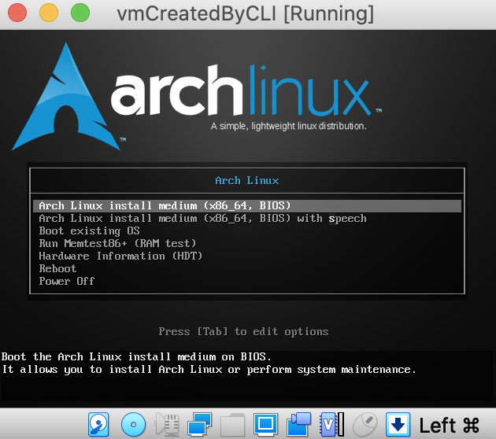

= Inception

____
42: https://cdn.intra.42.fr/pdf/pdf/89219/fr.subject.pdf[subject]
____

== Create a VM

. launch my interactive menu using the *_create_vm.sh_* script (located in the "scripts" folder)
+
[,bash]
----
sh scripts/create_vm.sh
----
 
. the interactive menu looks like this :
+
[,bash]
----
main menu:
1: setup the vm
2: list vms
3: exit
4: start the vm
5: generate info-vm.txt
6: remove archlinux iso
7: delete the vm
----

. select the first option to begin the setup of a new VM and follow the steps
+
NOTE: you can skip each step if you know what you are doing

** `*_create the vm_*` creates the .vbox file which contains the settings needed by VirtualBox to create the VM
** `*_download_archlinux_iso_*` downloads and place an archlinux disk image (.iso) in the _my_vm_created_by_cli/_ folder
** `*_attach_archlinux_iso_*` will "plug" the .iso as you would do with a bootable device to allow the VM to boot using it
** `*_create_vdi_*` creates the _virtual disk image_ (.vdi) file where the VM is created
** `*_create_vm_sata_*` creates the sata drive for the VM
** `*_start_vm_*` will do what it should do
** The following error should appear, just hit _Change Network Settings_ and hit _OK_ (default options should be fine) +

** boot up the VM +

. It can be good idea at this point to setup an SSH connection
.. J'ai oublie comment on fait

. once in the vm, launch the following command to setup the environment
+
[,bash]
----
sh -c "$(curl -fsSL https://raw.githubusercontent.com/t-h2o/inception/main/scripts/live_install_arch.sh)"
----

== Desktop environment

* Install packages
+
[,bash]
----
pacman -S xorg-server xfce4
----

* Launch the graphic interface
+
[,bash]
----
startxfce4
----

== Connection to the database

. enter into the wordpress container
. connect to the database
+
[,bash]
----
mysql \
  --user=${DATABASE_USER_NAME} \
  --password=${DATABASE_USER_PASSWORD} \
  --host=inception-container-mariadb \
  ${DATABASE_DATABASE}
----

== Resources

.mariadb
* https://mariadb.com/kb/en/[Knowledge Base]
* https://mariadb.com/kb/en/training-tutorials/[tutorials]

.wordpress
* https://wiki.alpinelinux.org/wiki/WordPress#Installing_and_configuring_WordPress[Install and configure in AlpineOS]
* https://wiki.archlinux.org/title/Wordpress#Configure_Nginx[Configure Nginx]
* https://wp-cli.org/[WP-CLI]

.docker compose
* https://docs.docker.com/compose/compose-file/compose-file-v3/[Compose file V3]

.nginx
* https://www.golinuxcloud.com/tutorial-pki-certificates-authority-ocsp/[golinuxcloud.com: Beginners guide on PKI, Certificates, Extensions, CA, CRL and OCSP]
